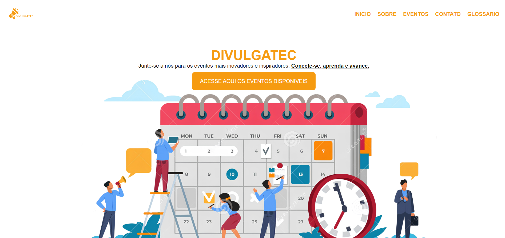

# DivulgaTEC

**DivulgaTEC** é um projeto desenvolvido como parte da disciplina Aplicações para Internet da faculdade. O site foi criado em grupo e tem como objetivo promover eventos de tecnologia pelo Brasil, proporcionando uma plataforma para que os usuários descubram e se conectem com eventos inovadores e inspiradores no campo da tecnologia.

## 🛠 Tecnologias Utilizadas

- **HTML**: Estrutura do site.
- **CSS**: Estilização e layout.

## 📁 Estrutura do Projeto

- **index.html**: Página inicial do site.
- **sobre.html**: Página com informações sobre o projeto e seus objetivos.
- **eventos.html**: Página com a listagem de eventos ativos.
- **contato.html**: Página para contato e envio de sugestões de eventos.
- **glossario.html**: Página com um glossário de termos técnicos.

## 🌐 Visão Geral

### Cabeçalho

- **Logo**: Imagem de logo da DivulgaTEC.
- **Navegação**: Links para as principais seções do site: Início, Sobre, Eventos, Contato e Glossário.

### Seção Inicial

- **Apresentação**: Mensagem de boas-vindas e chamada para explorar os eventos disponíveis.

### Seção Sobre

- **Propósito**: Explicação sobre o propósito do DivulgaTEC e seus pilares fundamentais.
- **Imagens e Créditos**: Créditos das imagens utilizadas e links para sites de inspiração.

### Seção de Eventos

- **Eventos Ativos**: Lista de eventos tecnológicos com descrições e links para mais informações.
- **Imagens e Créditos**: Créditos das imagens e textos utilizados.

### Rodapé

- **Informações de Contato**: Mensagem final e informações de copyright.
