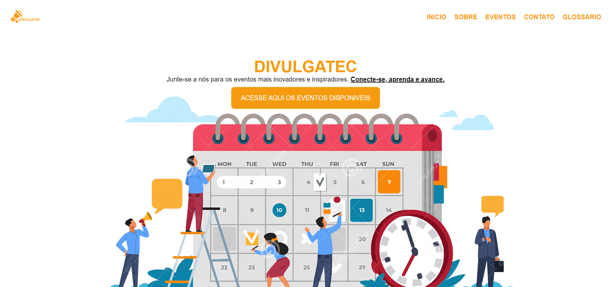

<div align="center">


# DivulgaTEC

**Site de divulgação de eventos de tecnologia pelo Brasil, feito em HTML e CSS puros para a disciplina Aplicações para Internet.**

<a href="https://luis-lhgdf.github.io/divulgatec/"></a>

[](https://luis-lhgdf.github.io/divulgatec/)


</div>

---

Projeto em grupo da disciplina **Aplicações para Internet**, do curso de Análise e Desenvolvimento de Sistemas. A proposta: uma vitrine de eventos de tecnologia para que as pessoas descubram o que está acontecendo na área e se conectem. Sem JavaScript, sem framework, sem build: só HTML e CSS.

## Ver online

**https://luis-lhgdf.github.io/divulgatec/**

O site é servido direto da branch `main` pelo GitHub Pages. Todos os caminhos são relativos, então ele funciona igual no Pages e abrindo o `index.html` no navegador.

## Páginas

| Arquivo | O que mostra |
|---|---|
| `index.html` | Início: apresentação, a seção **Sobre** (propósito e pilares do projeto) e os **Eventos ativos** |
| `evento01.html` | FEBRABAN TECH 2024 |
| `evento02.html` | Big Data Brazil Experience 2024 |
| `contato.html` | Formulário para contato e sugestão de eventos |
| `glossario.html` | Glossário das tags HTML e propriedades CSS usadas no projeto |

Os créditos das imagens e dos textos ficam nas próprias páginas, nas seções **Sobre** e **Eventos**.

## Rodando localmente

```bash
git clone https://github.com/Luis-lhgdf/divulgatec.git
cd divulgatec
```

Abra `index.html` no navegador. Se preferir um servidor local:

```bash
python -m http.server 8000
# http://localhost:8000
```

## Estrutura

```
index.html          início, sobre e eventos ativos
evento01.html       página do evento 1
evento02.html       página do evento 2
contato.html        formulário de contato
glossario.html      glossário de HTML e CSS
css/style.css       toda a estilização
img/                logotipo, ilustrações e imagens dos eventos
docs/
  documentacao.md   tags HTML e propriedades CSS usadas, explicadas uma a uma
  requisitos.pdf    documento de requisitos do projeto
  preview.png       print usado neste README
```

## Documentação

[`docs/documentacao.md`](docs/documentacao.md) lista cada tag HTML e propriedade CSS usada no projeto com uma explicação curta: foi o material de estudo do grupo. [`docs/requisitos.pdf`](docs/requisitos.pdf) é o documento de requisitos.

---

## English

Static website promoting tech events across Brazil, built with plain HTML and CSS (no JavaScript, no framework) as a group assignment for a college web development course. Live at https://luis-lhgdf.github.io/divulgatec/. **Content is in Portuguese.**

---

## Licença

MIT — veja [LICENSE](LICENSE).
